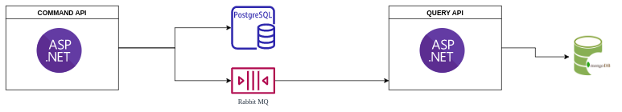

# CQRS Example With Asp.Net Core
## Local Environment
To spin up projects  
```
cd EasyCargo.Api.Commands  
docker-compose up -d

cd EasyCargo.Api.Queries
docker-compose up -d

```
and then run both projects

## Docker Environment

```
cd compose

docker-compose -f infrastructure.yml up -d --build

dokcer-compose -f services.yml up -d --build
```
Then 

you can access 

api-gateway  --> http://localhost:5002

query-service --> http://localhost:5001

command-service --> http://localhost:5000


### DIAGRAM  


